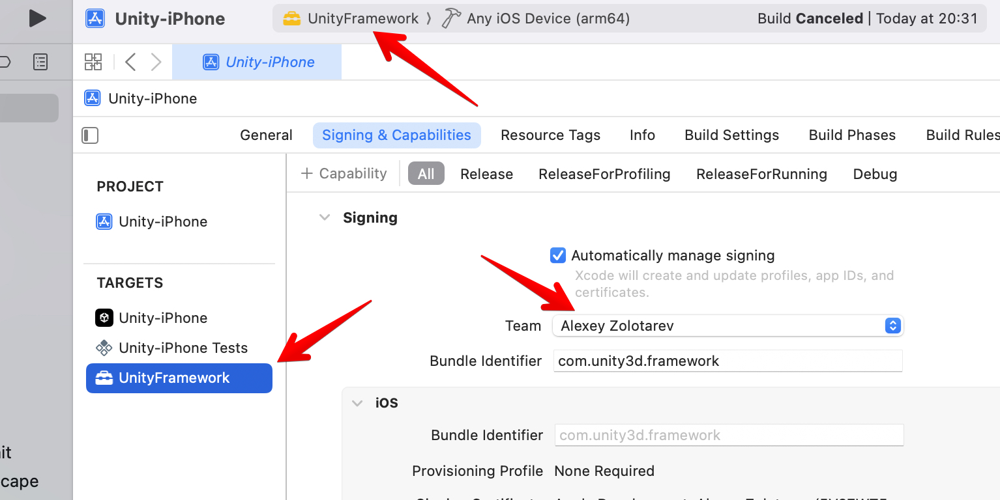
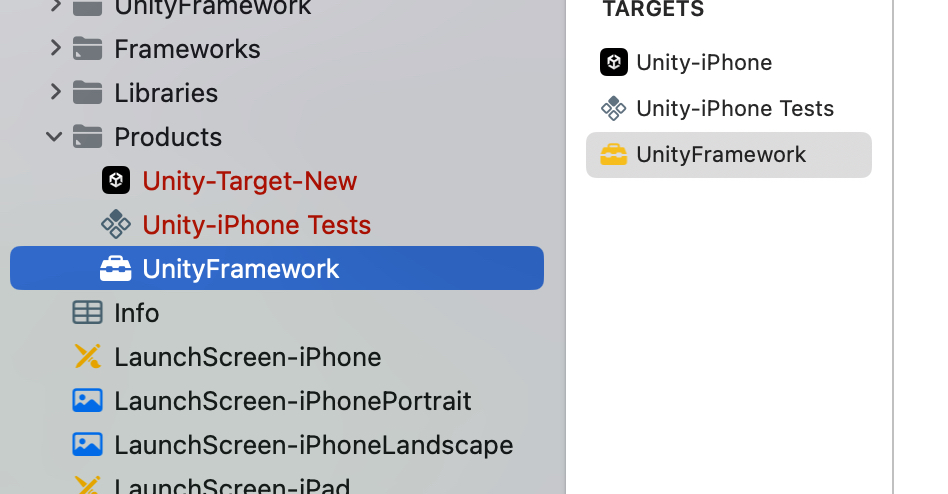

# Usage

expects environmment variable `UNITY_XCODE_BUILD` pointing to Unity XCode Build
Like this:
```bash
export UNITY_XCODE_BUILD=/path/to/your/UnityFramework.framework
```

to use locally run `npm pack` after `yarn install` to create an archived version of the module that then can be installed via path like this `npm install "file:../../react-native-unity/artmajeur-react-native-unity-0.0.6.tgz"`

---

# @artmajeur/react-native-unity

The plugin that allows you to embed a Unity project into React Native as a full-fledged component. The plugin now supports the new architecture.

### Android

Attention! Added support for Unity 2023 and above

> [!IMPORTANT]
> For iOS, it is no longer necessary to embed a project created with Unity. Only the built `UnityFramework` is used. It should be placed in the plugin folder at the path - `<YOUR_RN_PROJECT>/unity/builds/ios`

## Device Support:

| Platform         | Supported |
| ---------------- | --------- |
| iOS Simulator    | ❌        |
| iOS Device       | ✅        |
| Android Emulator | ✅        |
| Android Device   | ✅        |

# Installation

## Install this package in your react-native project:

```sh
npm install @artmajeur/react-native-unity

or

yarn add @artmajeur/react-native-unity
```

## Configure your Unity project:

1. Copy the contents of the folder `unity` to the root of your Unity project. This folder contains the necessary scripts and settings for the Unity project. You can find these files in your react-native project under `node_modules/@artmajeur/react-native-unity/unity`. This is necessary to ensure iOS has access to the `NativeCallProxy` class from this library.

2. (optional) If you're following along with the example, you can add the following code to the `ButtonBehavior.cs` script in your Unity project. This allows the button press in Unity to communicate with your react-native app.

<details>
<summary>ButtonBehavior.cs</summary>

```csharp
using System;
using System.Collections;
using System.Collections.Generic;
using System.Runtime.InteropServices;
using UnityEngine.UI;
using UnityEngine;

public class NativeAPI {
#if UNITY_IOS && !UNITY_EDITOR
  [DllImport("__Internal")]
  public static extern void sendMessageToMobileApp(string message);
#endif
}

public class ButtonBehavior : MonoBehaviour
{
  public void ButtonPressed()
  {
    if (Application.platform == RuntimePlatform.Android)
    {
      using (AndroidJavaClass jc = new AndroidJavaClass("com.azesmwayreactnativeunity.ReactNativeUnityViewManager"))
      {
        jc.CallStatic("sendMessageToMobileApp", "The button has been tapped!");
      }
    }
    else if (Application.platform == RuntimePlatform.IPhonePlayer)
    {
#if UNITY_IOS && !UNITY_EDITOR
      NativeAPI.sendMessageToMobileApp("The button has been tapped!");
#endif
    }
  }
}
```

</details>

## Export iOS Unity Project:

After you've moved the files from the `unity` folder to your Unity project, you can export the iOS unity project by following these steps:

1. Open your Unity project
2. Build Unity project for ios in ANY folder - just not the main RN project folder!!!
3. Open the created project in XCode
4. Select Data folder and set a checkbox in the "Target Membership" section to "UnityFramework" 
5. You need to select the NativeCallProxy.h inside the `Unity-iPhone/Libraries/Plugins/iOS` folder of the Unity-iPhone project and change UnityFramework’s target membership from Project to Public. Don’t forget this step! (if you don't see these files in your Xcode project, you didn't copy over the `unity` folder to your Unity project correctly in previous steps) 
6. If required - sign the project `UnityFramework.framework` and build a framework 
7. Open the folder with the built framework (by right-clicking) and move it to the plugin folder (`<YOUR_RN_PROJECT>/unity/builds/ios`) 
8. Remove your `Pods` cache and lockfile with this command in the root of the main RN project `rm -rf ios/Pods && rm -f ios/Podfile.lock && npx pod-install`

### Android

1. Open your Unity project
2. Export Unity app to `<YOUR_RN_PROJECT>/unity/builds/android`
3. Remove `<intent-filter>...</intent-filter>` from `<YOUR_RN_PROJECT>/unity/builds/android/unityLibrary/src/main/AndroidManifest.xml` at unityLibrary to leave only integrated version.

If you're using expo, you're done. The built-in expo plugin will handle the rest. If you're not using expo, you'll need to follow the steps below.

1. Add the following lines to `android/settings.gradle`:
   ```groovy
   include ':unityLibrary'
   project(':unityLibrary').projectDir=new File('..\\unity\\builds\\android\\unityLibrary')
   ```
2. Add into `android/build.gradle`
   ```groovy
   allprojects {
     repositories {
       // this
       flatDir {
           dirs "${project(':unityLibrary').projectDir}/libs"
       }
       // ...
     }
   }
   ```
3. Add into `android/gradle.properties`
   ```gradle
   unityStreamingAssets=.unity3d
   ```
4. Add strings to `android/app/src/main/res/values/strings.xml`

   ```javascript
   <string name="game_view_content_description">Game view</string>
   ```

# Known issues

- Does not work on the iOS simulator.
- On iOS the Unity view is waiting for a parent with dimensions greater than 0 (from RN side). Please take care of this because if it is not the case, your app will crash with the native message `MTLTextureDescriptor has width of zero`.

# Usage

## Sample code

```jsx
import React, { useRef, useEffect } from 'react';

import UnityView from '@artmajeur/react-native-unity';
import { View } from 'react-native';

interface IMessage {
  gameObject: string;
  methodName: string;
  message: string;
}

const Unity = () => {
  const unityRef = useRef<UnityView>(null);

  useEffect(() => {
    if (unityRef?.current) {
      const message: IMessage = {
        gameObject: 'gameObject',
        methodName: 'methodName',
        message: 'message',
      };
      unityRef.current.postMessage(
        message.gameObject,
        message.methodName,
        message.message
      );
    }
  }, []);

  return (
    <View style={{ flex: 1 }}>
      <UnityView
        ref={unityRef}
        style={{ flex: 1 }}
        onUnityMessage={(result) => {
          console.log('onUnityMessage', result.nativeEvent.message);
        }}
      />
    </View>
  );
};

export default Unity;
```

## Props

- `style: ViewStyle` - styles the UnityView. (Won't show on Android without dimensions. Recommended to give it `flex: 1` as in the example)
- `onUnityMessage?: (event: NativeSyntheticEvent)` - receives a message from a Unity
- `androidKeepPlayerMounted?: boolean` - if set to true, keep the player mounted even when the view that contains it has lost focus. The player will be paused on blur and resumed on focus. **ANDROID ONLY**
- `fullScreen?: boolean` - defaults to true. If set to false, will not request full screen access. **ANDROID ONLY**

## Methods

- `postMessage(gameObject, methodName, message)` - sends a message to the Unity. **FOR IOS:** The native method of unity is used to send a message
  `sendMessageToGOWithName:(const char*)goName functionName:(const char*)name message:(const char*)msg;`, more details can be found in the [documentation](https://docs.unity3d.com/2021.1/Documentation/Manual/UnityasaLibrary-iOS.html)
- `unloadUnity()` - the Unity is unloaded automatically when the react-native component is unmounted, but if you want to unload the Unity, you can call this method
- `pauseUnity?: (pause: boolean)` - pause the Unity
- `windowFocusChanged(hasFocus: boolean = false)` - simulate focus change (intended to be used to recover from black screen (not rendering) after remounting Unity view when `resumeUnity` does not work) **ANDROID ONLY**

# Contributing

See the [contributing guide](CONTRIBUTING.md) to learn how to contribute to the repository and the development workflow.

# License

MIT
